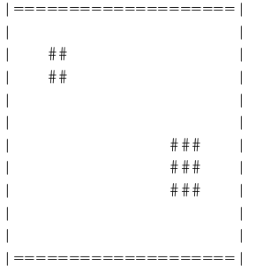

# ASCII Render project
---

## About:
- The project aim is to practice OOP through creating classes used for rendering a canvas with fun little shapes on it, from an ASCII textfile.
- the program is seperated into 
-- main.cpp
-- figures.h canvas.h (class headers)
-- figures.cpp, deltoid.cpp, rectangle.cpp, triangle.cpp (figure.h implementation files)
-- canvas.cpp (canvas.h implementation file)
-- obrazek.txt (output file)
-- text.txt (config file)
--the canvas is using a coordinate system that starts from the left upper corner and uses non-negative numbers only
### the desired output

## How to run it:
- simply type `make run` to make use of the provided makefile, compiling and running the program
- then use make `make ob` to display the created image

## Things which should be better
 - better comments
 - the naming conventions (many are unenlighting)
 - the complexity and entanglment of the code (reusability and modifing the code isn't as easy as it should)
 - seperation of tasks 
 - lack of design patterns (Should look up into the template pattern,since i have quite a lot very similar looking functions)
 - the classes 
 - Checking the validity of the data and proper error handling
 - amount of Tests
 - more options of modifying and more fun shapes
 - reliability
 - checking of edge cases
 
* note: I didn't add the option to modify the symbol representing shapes as it was specified #- is hardcoded *
*Made by Mikolaj.P*
